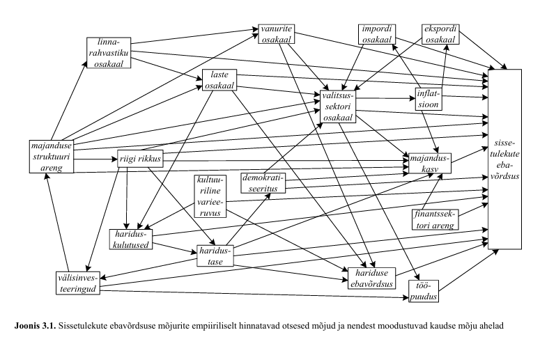

# Suunatud atsüklilised graafid (DAG)

## Sissejuhatus

Suunatud atsükliline graaf ehk **DAG** (*directed acyclic graph*) on üks lihtsamaid viise põhjuslike seoste kirjeldamiseks. DAG aitab kujutada, millised muutujad võivad üksteist mõjutada ning milliseid muutujaid peaks põhjusliku mõju hindamisel arvesse võtma.

DAG ei ole andmetest automaatselt leitud põhjuslik mudel. See on uurija teadmiste ja eelduste väljendus. Need eeldused võivad tugineda majandusteooriale, varasematele uuringutele, institutsioonide tundmisele või teadmistele selle kohta, kuidas mingi protsess tegelikult toimib.

DAG-i kasutatakse eelkõige selleks, et vastata küsimusele:

> Milliseid muutujaid peame põhjusliku mõju hindamisel arvesse võtma ja milliseid ei tohiks arvesse võtta?

Selles peatükis kasutame lihtsaid näiteid. Meie põhimuutujad on tavaliselt:

-   $D$ – sekkumine või poliitikameede;
-   $Y$ – tulemus;
-   $X$ – muu tunnus, mis võib mõjutada $D$-d, $Y$-d või mõlemat.

## Mis on DAG?

DAG koosneb muutujatest ja nendevahelistest nooltest.

Kui kirjutame

```{mermaid}
flowchart LR
    D["D"] --> Y["Y"]
```

siis tähendab see, et $D$ avaldab põhjuslikku mõju $Y$-le.

Näiteks:

-   $D$ – osalemine tööturukoolitusel;
-   $Y$ – hilisem palk.

Nool

$$ D \rightarrow Y $$

tähendab, et koolitus mõjutab palka.

## Otsene ja vahendatud mõju

Põhjuslik mõju võib olla otsene:

```{mermaid}
flowchart LR
    D["Koolitus D"] --> Y["Palk Y"]
```

või vahendatud mõne teise muutuja kaudu:

```{mermaid}
flowchart LR
    D["Koolitus D"] --> M["Oskused M"] --> Y["Palk Y"]
```

Teises näites suurendab koolitus oskusi ja paremad oskused suurendavad omakorda palka.

DAG-is on oluline ka see, **milliseid nooli ei ole**. Kui kahe muutuja vahel noolt ei ole, siis väidame oma põhjuslikus mudelis, et üks ei põhjusta otseselt teist.

## Miks on DAG atsükliline?

DAG-i põhjuslikud nooled liiguvad ühes suunas. Graafis ei tohi tekkida tsüklit, kus põhjuslik rada jõuab tagasi samasse muutujasse.

Näiteks võib tegelikus elus olla võimalik, et:

1.  haridus suurendab palka;
2.  suurem palk võimaldab hiljem omandada täiendavat haridust.

Seda ei kujutata ühe ja sama ajahetke tsüklina. Selle asemel eristatakse perioode:

```{mermaid}
flowchart LR
    E1["Haridus t"] --> W1["Palk t+1"] --> E2["Täiendav haridus t+2"]
```

Sellisel kujul liigub põhjuslikkus ajas edasi.

## Põhjuslik mõju ja võrdlusseisund

Põhjusliku mõju idee eeldab kahe võimaliku olukorra võrdlemist.

Näiteks:

-   D=1: inimene osales tööturukoolitusel;
-   D=0: sama inimene ei osalenud tööturukoolitusel.

Soovime teada, kuidas erineks tema palk nendes kahes olukorras.

Praktikas näeme ühe inimese puhul ainult ühte olukorda. Seetõttu vajame sobivat võrdlusgruppi ning eeldusi, mis võimaldavad käsitleda gruppide erinevust põhjusliku mõjuna.

DAG aitab sõnastada, millised eeldused on selle võrdluse jaoks vajalikud.

## Segaja ehk confounder

Üks olulisemaid DAG-i mõisteid on **segaja** (*confounder*).

Segaja on muutuja, mis mõjutab nii sekkumist $D$ kui ka tulemust $Y$.

Oletame, et:

-   $D$ – tööturukoolitus;
-   $Y$ – palk;
-   $X$ – eelnev haridus.

Kõrgema haridusega inimesed võivad suurema tõenäosusega koolitusel osaleda ning neil võib olla ka kõrgem palk.

```{mermaid}
flowchart LR
    X["Haridus X"] --> D["Koolitus D"]
    X --> Y["Palk Y"]
    D --> Y
```

Siin on kaks rada $D$ ja $Y$ vahel.

Põhjuslik rada:

$$ D \rightarrow Y $$

ja nn **tagauks** (*backdoor path*):

$$ D \leftarrow X \rightarrow Y. $$

Tagaukse kaudu tekkiv seos ei ole koolituse põhjuslik mõju. See tuleneb haridusest.

Kui võrdleme lihtsalt koolitusel osalenute ja mitteosalenute palku, segunevad kaks asja:

1.  koolituse tegelik mõju;
2.  osalejate ja mitteosalejate erinev haridustase.

## Tagaukse sulgemine

Kui $X$ on mõõdetav segaja, saame tagaukse sulgeda, võrreldes inimesi sama $X$ väärtuse korral.

Praktikas võib seda teha näiteks:

-   gruppides analüüsimisega;
-   regressioonimudeliga;
-   sobitamisega (*matching*);
-   kaalumismeetoditega (*inverse probability weighting*).

Näiteks regressioonimudelis:

$$ Y_i = \alpha + \beta D_i + \gamma X_i + \varepsilon_i $$

Kui DAG kirjeldab põhjuslikku protsessi õigesti ja vajalikud segajad on arvesse võetud, saab (\beta)-t tõlgendada $D$ põhjusliku mõjuna $Y$-le.

## Simuleeritud näide: mõõdetav segaja

Simuleerime olukorra, kus haridus mõjutab nii koolitusel osalemist kui ka palka.

Tegelik koolituse mõju palgale on simulatsioonis ainult 5 ühikut.

```{r}
#| label: sim-confounder
#| message: false
#| warning: false

packages <- c("tidyverse", "broom", "stargazer")

to_install <- packages[!packages %in% rownames(installed.packages())]
if (length(to_install) > 0) {
  install.packages(to_install)
}

library(tidyverse)
library(broom)
library(stargazer)
library(modelsummary)

set.seed(1632)

tb <- tibble(
  haridus = floor(runif(n = 1000, min = 9, max = 21)),
  koolitus = if_else(
    2 * haridus + rnorm(1000) > 35,
    1, 0
  ),
  palk = 1000 +
    20 * haridus +
    5 * koolitus +
    20 * rnorm(1000)
)

head(tb)
```

Kõigepealt hindame mudeli, kus palk sõltub ainult koolitusest.

```{r}
lm1 <- lm(palk ~ koolitus, data = tb)

#või kasuta modelsummary funktsiooni paketist modelsummary
#modelsummary(lm1, gof_omit = c("AIC|RMSE|BIC|R2 Ad|Log.Lik."))

stargazer(lm1, type = "text", no.space = TRUE,keep.stat = c("n", "rsq"))

```

See hinnang on nihkega, sest koolitusel osalejad on keskmiselt kõrgema haridusega.

Kontrollime seda otse:

```{r}
tb |>
  group_by(koolitus) |>
  summarise(
    n = n(),
    keskmine_haridus = mean(haridus),
    keskmine_palk = mean(palk)
  )
```

Nüüd lisame regressioonimudelisse hariduse.

```{r}

#| results: asis

lm2 <- lm(palk ~ koolitus + haridus, data = tb)

stargazer(lm1, lm2, type = "text", no.space = TRUE, keep.stat = c("n", "rsq"), column.labels= c("Hariduseta", "Haridusega"))

#modelsummary(models = list(lm1,lm2), gof_omit = c("AIC|RMSE|BIC|R2 Ad|Log.Lik."))

```

Teise mudeli koolituse koefitsient on palju lähemal simulatsioonis ette antud tegelikule mõjule (5).

**Intuitsioon:** hariduse arvesse võtmisega võrdleme koolitusel osalenud ja mitteosalenud inimesi tingimusel, et nende haridustase on sama. Sellega sulgeme tagaukse

$$ D \leftarrow X \rightarrow Y. $$

## Mittevaadeldav segaja

Keerulisem olukord tekib siis, kui segaja mõjutab nii sekkumist kui ka tulemust, kuid seda ei ole andmetes mõõdetud.

Näiteks:

-   $D$ – tööturukoolitus;
-   $Y$ – palk;
-   $U$ – inimese võimekus.

```{mermaid}
flowchart LR
    U["Võimekus U"] --> D["Koolitus D"]
    U --> Y["Palk Y"]
    D --> Y
```

Kui $U$-d ei mõõdeta, jääb tagauks

$$ D \leftarrow U \rightarrow Y $$

avatuks.

Sellisel juhul ei piisa tavalisest regressioonmudelist, kuhu lisame ainult olemasolevad mõõdetud tunnused. Kui oluline segaja jääb puudu, võib hinnang olla nihkega.

## Simuleeritud näide: mittevaadeldav segaja

```{r}
#| label: sim-unobserved-confounder

set.seed(1632)

tb_u <- tibble(
  voimekus = rnorm(1000),
  koolitus = if_else(
    2 * voimekus + rnorm(1000) > 0.75,
    1, 0
  ),
  palk = 1000 +
    100 * voimekus +
    5 * koolitus +
    20 * rnorm(1000)
)

lmu <- lm(palk ~ koolitus, data = tb_u)

stargazer(lmu, type = "text", no.space = TRUE,keep.stat = c("n", "rsq"))

```

Kuigi tegelik koolituse mõju on 5, näitab regressioonimudel palju tugevamat seost.

Põhjus on selles, et koolitusel osalemine kannab endas infot ka inimese võimekuse kohta.

```{r}
tb_u |>
  group_by(koolitus) |>
  summarise(
    keskmine_voimekus = mean(voimekus),
    keskmine_palk = mean(palk)
  )
```

Põhjuslik analüüs ei ole ainult regressioonimudeli hindamise tehnika küsimus. Vajame ka teadmisi selle kohta, millised olulised segajad võivad olemas olla.

## Kollaider ehk põrguti

Teine väga oluline DAG-i mõiste on **kollaider** (*collider*), mida selles kursuses nimetame ka **põrgutiks**.

Kollaider on muutuja, mida põhjustavad kaks teist muutujat.

```{mermaid}
flowchart LR
    D["D"] --> X["Kollaider X"]
    Y["Y"] --> X
```

Siin on $X$ kollaider, sest sinna suundub kaks noolt:

$$ D \rightarrow X \leftarrow Y. $$

Oluline erinevus segajast on järgmine:

-   segaja puhul nooled **lähevad segajast välja**;
-   kollaideri puhul nooled **tulevad kollaiderisse sisse**.

## Miks ei tohi kollaiderit arvesse võtta?

Kollaideri rada on algselt suletud.

Kui hakkame aga $X$-i arvestama, näiteks lisame selle regressioonimudelisse, võime tekitada $D$ ja $Y$ vahele kunstliku seose, mida seal ei ole.

Seetõttu kehtib lihtne praktiline reegel:

> Kõiki olemasolevaid kontrollmuutujaid ei ole mõistlik regressiooni lisada.

Muutuja lisamine võib vähendada nihet, kuid mõnel juhul võib see hoopis nihet tekitada.

## Simuleeritud näide: kollaiderist tekkiv nihe

Kasutame lihtsat näidet:

-   $D$ – haridus;
-   $Y$ – palk;
-   $X$ – abikaasa "skoor".

Oletame, et inimese abikaasa valikut mõjutavad nii tema haridus kui ka palk.

```{mermaid}
flowchart LR
    D["Haridus D"] --> Y["Palk Y"]
    D --> X["Abikaasa skoor X"]
    Y --> X
```

Siin on abikaasa skoor $X$ kollaider.

Simuleerime andmed.

```{r}
#| label: sim-collider

set.seed(1632)

tb_c <- tibble(
  haridus = floor(runif(n = 1000, min = 9, max = 21)),
  palk = 1000 + 10 * haridus + 50 * rnorm(1000),
  abikaasaskoor = haridus + palk / 100 + 2 * rnorm(1000)
)

head(tb_c)
```

Tegelik hariduse mõju palgale on simulatsioonis 10 ühikut.

Kõigepealt hindame õige lihtsa mudeli.

```{r}
lmc1 <- lm(palk ~ haridus, data = tb_c)
stargazer(lmc1, type = "text", no.space = TRUE,keep.stat = c("n", "rsq"))

```

Nüüd lisame mudelisse kollaideri `abikaasaskoor`.

```{r}
lmc2 <- lm(palk ~ haridus + abikaasaskoor, data = tb_c)

stargazer(lmc1, lmc2, type = "text", no.space = TRUE, keep.stat = c("n", "rsq"), column.labels =  c("Ilma põrgutita", "Põrguti mudelis"))

```

Hariduse mõju koefitsient muutub, kuigi `abikaasaskoor` võib esmapilgul tunduda täiesti mõistliku kontrollmuutujana.

Probleem on selles, et `abikaasaskoor` on ise inimese hariduse ja palga tulemus.

Kui leiame selle järgi tingimusliku keskväärtuse, siis hoopis avame raja

$$ D \rightarrow X \leftarrow Y. $$

Seda nimetatakse **põrgutinihkeks / kollaiderinihkeks** (*collider bias*).

## Segaja ja põrguti võrdlus

| Tunnus | Segaja (*confounder*) | Põrguti (*collider*) |
|------------------------|------------------------|------------------------|
| Graafi kuju | $D \leftarrow X \rightarrow Y$ | $D \rightarrow X \leftarrow Y$ |
| Mis roll on $X$-il? | $X$ põhjustab nii $D$-d kui $Y$-d | $D$ ja $Y$ põhjustavad $X$-i |
| Kas rada on algselt avatud? | Jah | Ei |
| Kas $X$-i peaks lisama kontrollmuutujaks? | Jah | Ei |
| Mis juhtub valesti käitudes? | Segamisest tulenev nihe jääb alles | Võime tekitada kollaiderinihke |

Kõige olulisem on noole suund.

Üks ja sama statistiline korrelatsioonitabel ei ütle meile, kas muutuja on segaja või põrguti. Selle määramiseks vajame teadmisi põhjusliku protsessi kohta.

## Mida panna regressioonimudelisse?

DAG-i vaatenurgast ei ole hea strateegia panna regressiooni automaatselt "kõik olemasolevad muutujad".

Enne mudeli hindamist tasub küsida:

1.  Milline on minu sekkumine $D$?
2.  Milline on tulemus $Y$?
3.  Millised muutujad põhjustavad nii $D$-d kui ka $Y$-d?
4.  Kas nende kaudu on avatud tagauksi?
5.  Millised muutujad on $D$ või $Y$ tagajärjed?
6.  Kas mõni kontrollmuutuja on kollaider?

Kui $X$ on segaja:

```{mermaid}
flowchart LR
    X["X"] --> D["D"]
    X --> Y["Y"]
    D --> Y
```

siis on $X$-i arvesse võtmine tavaliselt vajalik.

Kui $X$ on kollaider:

```{mermaid}
flowchart LR
    D["D"] --> X["X"]
    Y["Y"] --> X
```

siis võib $X$-i arvesse võtmine tekitada nihke.

## DAG ja põhjusliku mõju identifitseerimine

DAG aitab sõnastada **identifitseeriva eelduse** (*identifying assumption*).

Lihtsa segaja näite puhul on idee järgmine:

> Kui arvestame haridust, ei ole koolitusel osalejate ja mitteosalejate vahel enam muid selliseid erinevusi, mis mõjutaksid palka.

See on tugev sisuline eeldus. Andmed ise ei tõesta tavaliselt, et kõik olulised segajad on mõõdetud.

Seetõttu peab põhjuslik analüüs ühendama:

-   teooria;
-   institutsioonide tundmise;
-   varasemad empiirilised uuringud;
-   sobiva uuringudisaini;
-   statistilise meetodi.

DAG aitab need eeldused nähtavaks teha.

## Näide ettevõtluse valdkonnast

### Segaja: turunduskampaania ja müügitulu

Oletame, et soovime hinnata, kas **turunduskampaania** suurendab ettevõtte müügitulu.

- $D$ – turunduskampaania;
- $Y$ – müügitulu;
- $X$ – ettevõtte turunduseelarve või üldine ressursside tase.

Suuremate ressurssidega ettevõtted teevad tõenäolisemalt turunduskampaaniaid. Samal ajal võivad suuremad ressursid ka ilma kampaaniata suurendada ettevõtte müügitulu.

Seega mõjutab $X$ nii $D$-d kui ka $Y$-d ning on **segaja**.

```{mermaid}
flowchart LR
    X["Ettevõtte ressursid X"] --> D["Turunduskampaania D"]
    X --> Y["Müügitulu Y"]
    D --> Y
```

Kui ettevõtte ressursse analüüsis ei arvestata, võib turunduskampaania hinnatud mõju sisaldada ka erinevusi ettevõtete ressurssides.

Näiteks võivad suuremad ettevõtted teha sagedamini reklaamikampaaniaid ja neil võib olla ka suurem müük juba enne kampaaniat. Lihtne kampaaniaga ja kampaaniata ettevõtete müügi võrdlus võib seetõttu kampaania mõju üle hinnata.

Kui $X$ on mõõdetav, saame seda arvesse võtta näiteks regressioonimudelis.

### Põrguti: innovatsioon, kasumlikkus ja investorite huvi

Oletame nüüd, et soovime hinnata, kas innovaatilise toote turuletoomine suurendab ettevõtte kasumlikkust.

- $D$ – innovaatilise toote turuletoomine;
- $Y$ – ettevõtte kasumlikkus;
- $C$ – investorite huvi või rahastuse saamine.

Innovaatilise toote turuletoomine võib suurendada investorite huvi. Samal ajal võib ka kõrge kasumlikkus muuta ettevõtte investorite jaoks atraktiivsemaks.

Seega mõjutavad nii $D$ kui ka $Y$ muutujat $C$.

```{mermaid}
flowchart LR
    D["Innovaatiline toode D"] --> Y["Kasumlikkus Y"]
    D --> C["Investorite huvi C"]
    Y --> C
```

Muutuja $C$ on siin põrguti, sest kaks noolt suunduvad sellesse.

Kui me $C$-d analüüsis ei arvesta, on see rada suletud ja kõik on korras.

Kui aga piirame valimi näiteks ainult ettevõtetega, kes said investoritelt rahastuse, või lisame investorite huvi kontrollmuutujana otse regressiooni, siis on meil $C$ arvesse võetud ja saame nihkega hinnangu innovaatilise toote ja kasumlikkuse vahel olevale seosele.

Näiteks investorite rahastuse saanud ettevõtete hulgas võib olla:

- innovaatilisi ettevõtteid, mille kasumlikkus ei ole veel kõrge;
- väga kasumlikke ettevõtteid, mille innovatsioonitase on madalam.

Kui vaatame ainult rahastuse saanud ettevõtteid, võib innovatsiooni ja kasumlikkuse vahel tekkida seos (negatiivne (!)), mida üldkogumis sellisel kujul ei ole.

## Kokkuvõte

Suunatud atsükliline graaf ehk DAG on vahend põhjuslike eelduste kirjeldamiseks.

Meeldes pidada:

-   nool $D \rightarrow Y$ tähistab põhjuslikku mõju;
-   DAG-is liigub põhjuslikkus ühes suunas ja tsükleid ei ole;
-   **segaja** (*confounder*) mõjutab nii sekkumist kui ka tulemust;
-   segaja võib avada tagaukse $D \leftarrow X \rightarrow Y$;
-   mõõdetava segaja arvesse võtmine sulgeb tagaukse;
-   mittevaadeldav segaja, mida ei saa arvestada, võib põhjustada nihkega hinnangu;
-   **kollaider ehk põrguti** (*collider*) on kahe muutuja ühine tagajärg;
-   põrguti lisamine mudelisse võib avada varem suletud raja ja hoopis tekitada nihke (*collider bias*);
-   regressioonimudelis, millega soovitakse hinnata põhjuslikke seoseid, ei ole eesmärk lisada võimalikult palju kontrollmuutujaid, vaid valida muutujad vastavalt põhjuslikule mudelile.

Kõige olulisem küsimus enne regressioonimudeli hindamist ei ole seega ainult

> "Millised muutujad mul andmestikus olemas on?"

vaid

> "Milline põhjuslik roll on igal muutujal minu uurimisküsimuses?"

Põhjuslikus analüüsis ei ole hea reegel panna regressioonimudelisse võimalikult palju kontrollmuutujaid. Kõigepealt tuleb mõelda, milline põhjuslik roll igal muutujal on.


## Lisa: Seos DAG-i, struktuursete võrrandite mudeli ja kinnitava faktoranalüüsi vahel

Lisaks DAGile kasutavad muutujate ja nendevaheliste seoste kirjeldamiseks graafilist esitusviisi ka **struktuursete võrrandite mudelid** (*structural equation models, SEM*) ja **kinnitav faktoranalüüs** (*confirmatory factor analysis, CFA*). Tunnuseid kujutatakse sõlmedena ning nendevahelisi seoseid nooltena. Noolte tähendus ei ole siiski kõigis kolmes lähenemises päris sama.

DAG kirjeldab eelkõige meie **põhjuslikke eeldusi**. Kui graafis on nool, siis väidame, et `X` võib otseselt mõjutada `Y`-d. Sama mõtet saab väljendada struktuurse võrrandiga:

$$
Y = \beta X + \varepsilon_Y.
$$

Kui meil on näiteks DAG

```{mermaid}
flowchart LR
    X["X"] --> D["D"]
    X --> Y["Y"]
    D --> Y
```

siis sellele võib vastata võrrandisüsteem:

$$
D = \alpha_0 + \alpha_1 X + \varepsilon_D,
$$

$$
Y = \beta_0 + \beta_1 D + \beta_2 X + \varepsilon_Y
$$

Seega võib DAG-i vaadelda kui struktuursete võrrandite süsteemi **graafilist kirjeldust**: iga muutuja sõltub oma graafis olevatest „vanematest” (*parents*). DAG ise ei ütle tavaliselt, kas seos on lineaarne, kui suur on koefitsient või milline on vealiikme jaotus. SEM lisab nendele nooltele funktsionaalse kuju ja hinnatavad parameetrid. Selline seos DAG-ide ja struktuursete võrrandite vahel on ka tänapäevase strukturaalse põhjusmudeli (*structural causal model*) üks aluseid.

Oluline on siiski terminoloogiline erinevus. Mitte iga tavapärane SEM ei ole automaatselt põhjuslik mudel. SEM-i diagrammis võib nool tähistada regressiooniseost, mille põhjuslik tõlgendus sõltub samamoodi sisulistest eeldustest nagu tavalise regressiooni puhul. Lisaks kasutatakse SEM-is sageli kahesuunalisi nooli kovariatsioonide ja omavahel korreleeritud vigade tähistamiseks; puhtas DAG-is kasutatakse ainult suunatud nooli ja tsükleid ei ole.

Näide Anneli Kaasa (2003) doktoritööst "Sissetulekute ebavõrdsuse mõjurite analüüs struktuurse modelleerimise meetodil" 

{#fig-sem width=90%}

**Kinnitav faktoranalüüs (CFA)** on SEM-i mõõtemudeli erijuht. CFA-d kasutatakse siis, kui mingi mõiste ei ole otseselt mõõdetav. Sellist tunnust nimetatakse **latentseks muutujaks**. (Nähtus on olemas, aga me ei saa otse mõõta vaid kaudselt teiste näitajate abil.)

Näiteks ettevõtte või inimese „ettevõtlikku orientatsiooni” ei saa ühe arvuga otseselt vaadelda. Seda võib mõõta mitme küsimuse või indikaatori abil:

```{mermaid}
flowchart LR
    EO(("Ettevõtlik orientatsioon")) --> I["Innovaatilisus"]
    EO --> R["Riskivalmidus"]
    EO --> P["Proaktiivsus"]
```

CFA mõõtemudelis võib näiteks esimese indikaatori võrrand olla

$$
I = \lambda_1 EO + \varepsilon_I
$$

ning analoogselt teiste indikaatorite puhul. Koefitsienti `lambda` nimetatakse **faktorlaadungiks** (*factor loading*).

CFA puhul tähistab nool eelkõige seda, **kuidas latentset konstrukti mõõdetakse**. Seda noolt ei tohiks automaatselt tõlgendada samamoodi nagu poliitikameetme põhjuslikku mõju DAG-is. CFA kontrollib, kas andmed sobivad uurija poolt eelnevalt määratud faktorstruktuuriga. SEM võib seejärel ühendada mõõtemudeli ja latentsete või vaadeldavate muutujate vahelise struktuurse mudeli.

**Sarnasused ja erinevused**

|   | DAG | SEM | CFA |
|------------------|------------------|------------------|------------------|
| Kasutab tunnuseid ja nooli | jah | jah | jah |
| Põhieesmärk | põhjuslike eelduste kirjeldamine ja identifitseerimine | mitme võrrandi/seose samaaegne modelleerimine | latentsete tunnuste mõõtemudeli kontrollimine |
| Latentsed muutujad | võimalikud, enamasti väljas | väga tavalised | keskne osa |
| Nool tähendab | põhjuslikku eeldust | regressiooni- või struktuurset seost; põhjuslikkus vajab lisaeeldusi | faktorlaadungit ehk mõõtmisseost |
| Kahesuunalised nooled | ei kuulu tavalisse DAG-i | kasutatakse kovariatsioonide jaoks | kasutatakse faktorite või vigade kovariatsioonide jaoks |

Seega on DAG ja SEM lähedased sugulased, kuid nende eesmärk on erinev. DAG keskendub küsimusele, milline põhjuslik struktuur peab kehtima, et mõju oleks identifitseeritav. SEM lisab graafile hinnatavad võrrandid ning võimaldab töötada latentsete muutujatega. CFA on omakorda SEM-i osa, mis keskendub küsimusele, kuidas latentseid mõisteid vaadeldavate tunnuste abil mõõta.


<!-- ## Kasutatud kirjandus -->


