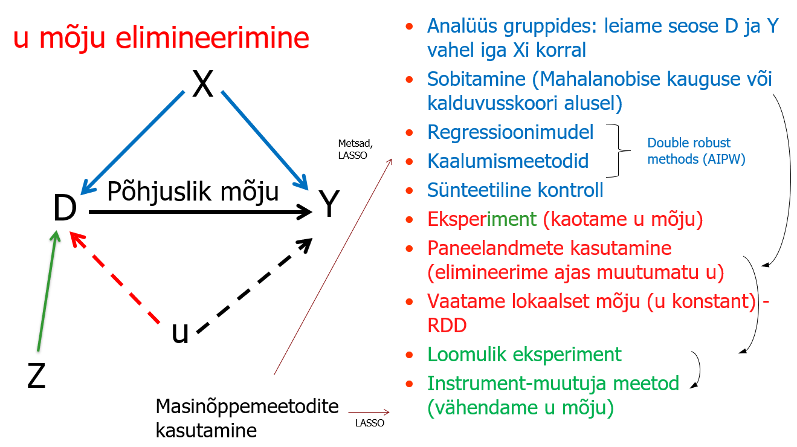

# Sissejuhatus {.unnumbered}

Käesolev lühikonspekt on mõeldud tutvustamaks mõju hindamise meetodeid (*causal inference*) Tartu Ülikooli majandustudengitele. Konspekt on mõeldud aine "Põhuse ja tagajärje seosed" õppematerjaliks.

Õpik annab alguses ülevaate graafilistest ja matemaatilistest abivahenditest (DAG, POM) ning seejärel keskendub mõju hindamise meetoditele majanduses. Esmalt vaadatakse, kuidas arvestada jälgitavate taustatunnuste $X$ erinevust (alloleval joonisel sinine osa). Õpik vaatab arvutamist alamrühmades, sobitamist (*matching*), regressioonimudeleid, kaalumismeetodeid ja sünteetilise kontrolli meetodit. Seejärel tutvustatakse meetodeid, kuidas elimineerida mittejälgitavate tunnuste $u$ mõju (joonisel punane ja roheline.) Esmalt vaatame paneelandmete mudeleid (DIF-DIF olemus ja nende kaasaegsed lähenemised), seejärel regressioon katkemise meetodit (RDD). Samuti anname ülevaate instrumentmuutuja meetodist.

{#fig-sem width="80%"}

Õpiku lõpuosas on ka näited masinõppemeetodite kasutamisest, nii selgitavate tunnuste arvesse võtmisel (*causal forests*) kui ka instrumentide valimisel (LASSO). Õpikus ei käsitleta eraldi eksperimentide läbiviimise teemat.

Konspektis kasutatakse näiteid tarkvaraga R. Konspektis kasutatud näiteandmestikud on anonümiseeritud, avaandmed või simuleeritud andmed.

Konspekt on jooksvalt täienev õppetöö käigus. Konspekti kirjutamisel on kasutatud ka erinevate keelemudelite abi, mistõttu kõik asjad ei ole veel korrektselt viidatud algallikatele ja võib esineda veel kontrollimata apse tekstis. Seega kasutamine väljaspool TÜ majandusteaduskonna õppetööd on omal vastutusel.

Märkused saata meilile andres.vork\@ut.ee
